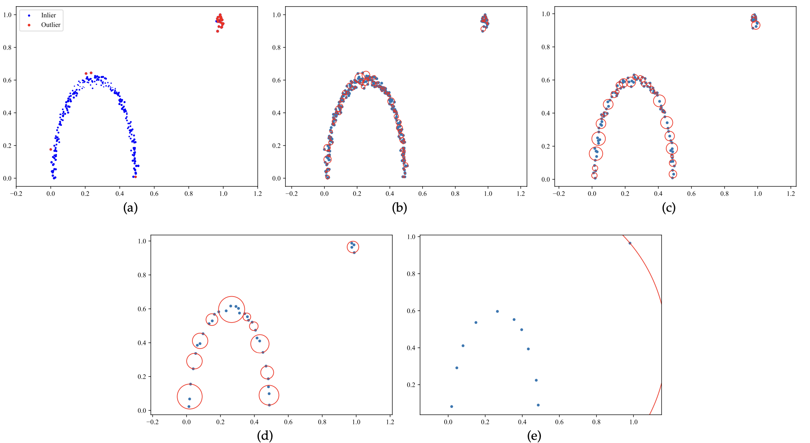

# Fuzzy Granule Density-Based Outlier Detection with Multi-Scale Granular Balls
Can Gao, Xiaofeng Tan, Jie Zhou, Weiping Ding, and Witold Pedrycz

This repository is the official implementation of the TKDE submission "**Fuzzy Granule Density-Based Outlier Detection with Multi-Scale Granular Balls**".

<!-- Visit our [**webpage**](https://www.pinlab.org/coskad) for more details. -->
## Abstract
Outlier detection refers to the identification of anomalous samples that deviate significantly from the distribution of normal data and has been extensively studied and used in a variety of practical tasks. However, most unsupervised outlier detection methods are carefully designed to detect specified outliers, while real-world data may be entangled with different types of outliers. In this study, we propose a fuzzy rough sets-based multi-scale outlier detection method to identify various types of outliers. Specifically, a novel fuzzy rough sets-based method that integrates relative fuzzy granule density is first introduced to improve the capability of detecting local outliers. Then, a multi-scale view generation method based on granular-ball computing is proposed to collaboratively identify group outliers at different levels of granularity. Moreover, reliable outliers and inliers determined by the three-way decision are used to train a weighted support vector machine to further improve the performance of outlier detection. The proposed method innovatively transforms unsupervised outlier detection into a semi-supervised classification problem and for the first time explores the fuzzy rough sets-based outlier detection from the perspective of multi-scale granular balls, allowing for high adaptability to different types of outliers. Extensive experiments carried out on both artificial and UCI datasets demonstrate that the proposed outlier detection method significantly outperforms the state-of-the-art methods, improving the results by at least 8.48% in terms of the Area Under the ROC Curve (AUROC) index.


 

## Content
```
.
├── README.md
├── assets
│   ├── 1.png
│   └── 2.png
├── datasets
│   ├── 15_Hepatitis.npz
│   ├── 28_pendigits.npz
│   ├── 31_satimage-2.npz
│   ├── 35_SpamBase.npz
│   ├── 45_wine.npz
│   ├── 46_WPBC.npz
│   ├── 4_breastw.npz
│   ├── 7_Cardiotocography.npz
│   ├── MVTec-AD_carpet.npz
│   ├── MVTec-AD_metal_nut.npz
│   ├── MVTec-AD_pill.npz
│   ├── arrhythmia.mat
│   ├── autos_variant1.mat
│   ├── cardio.mat
│   ├── chess_nowin_227_variant1.mat
│   ├── ionosphere_b_24_variant1.mat
│   ├── iris_Irisvirginica_11_variant1.mat
│   ├── mammography.mat
│   ├── thyroid_disease_variant1.mat
│   └── wdbc_M_39_variant1.mat
├── main
│   ├── FRS_OD.py
│   ├── GB.py
│   ├── __pycache__
│   │   ├── FRS_OD.cpython-310.pyc
│   │   ├── GB.cpython-310.pyc
│   │   └── units.cpython-310.pyc
│   ├── main.py
│   ├── paramaters.pkl
│   └── units.py
├── paramaters.pkl
├── requirements.txt
└── results
```

## Setup
### Environment
```sh
conda env create -f environment.yml
```

### Datasets
The datasets are selected from [BElloney](https://github.com/BElloney/Outlier-detection) and [ADBench](https://github.com/Minqi824/ADBench), and provided in 
```
./datasets.
```

|Datasets| Description                                                                                                                                                                                                      |
|----------|------------------------------------------------------------------------------------------------------------------------------------------------------------------------------------------------------------------|
| Arrhyth  | Samples from the minority classes 3, 4, 5, 7, 8, 9, 14, and 15 are grouped into outliers, while the remaining samples are considered as inliers.                                                                 |
| Autos    | Samples from "-2" and "-1" classes are regarded as outliers, and samples from other classes are considered as inliers.                                                                                         |
| Breast   | Samples in the "malignant" class are treated as outliers, while samples in the "benign" class are considered as inliers.                                                                                       |
| Cardio   | The "pathologic" class is downsampled to 176 samples, and these samples are regarded as outliers. Samples in the "normal" class are considered as inliers, and samples in the "suspect" class are all removed. |
| Cardioto | The classes "2" and "3" are downsampled to 33 samples and selected as outliers, while other classes are all considered inliers.                                                                                |
| Carpet   | This is a category from the commonly used MVTec AD datasets and contains both normal and defective carpet samples.                                                                                               |
| Chess    | The classes "nowin" is downsampled to 227 samples and treated as outliers, while other samples from the remaining class are considered as inliers.                                                              |
| Hepat    | Samples in the "hepatitis" class are regarded as outliers, and samples in the "non-hepatitis" class are considered as inliers.                                                                                 |
| Iono     | The classes "b" is downsampled to 24 anomalous samples, where samples from the remaining class are recognized as inliers.                                                                                       |
| Iris     | The "iris-virginica" class is downsampled to 11 anomalous samples, and samples from other classes are considered as inliers.                                                                                    |
| Mammo    | Samples in the "calcification" class are regarded as outliers, and other samples are considered as inliers.                                                                                                     |
| Metal    | This is a category from the commonly used MVTec AD datasets and contains both normal and defective metal samples.                                                                                                |
| Pen      | Samples in the "0" class are regarded as outliers, and the remaining digit samples (1 to 9) are considered as inliers.                                                                                          |
| Pill     | This is a category from the commonly used MVTec AD datasets and contains both normal and defective pill samples.                                                                                                 |
| Sat      | The "2" class is downsampled to 71 anomalous samples, while samples from other classes are combined to be inliers.                                                                                              |
| Spam     | Samples in the "spam" class are regarded as outliers, and samples in the "non-spam" class are considered as inliers.                                                                                           |
| Thyroid  | Samples in the "hyperfunction" class are treated as outliers, while samples in the normal and subnormal functions are considered as inliers.                                                                    |
| WDBC     | The "M" class is downsampled 39 samples and recognized as outliers, while other samples are considered as inliers.                                                                                              |
| Wine     | The "1" class is downsampled to 10 samples and treated as outliers, while samples from the "2" and "3" classes are considered as inliers.                                                                     |
| WPBC     | Samples in the "R" (minority) class are recognized as outliers, and other samples are regarded as inliers.                                                                                                      |

### **Running** 
To reproduce the results reported in our paper, you can run the code as follows:
``` sh
cd main
python main.py
```
The result will be saved in the folder ./results.

## **Modules**
This project contains the following important modules:
1. ``./main/FRS_OD.py``: the implementation of FRS-based outlier detection methods, and the variant in GB views;
2. ``./main/GB.py``: the implementation of GB generation methods and views update;
3. ``./main/units.py``: some auxiliary function;
4. ``./paramaters.pkl``: the hyperparameter settings.


## Appendix
### I. View generation
The proposed method starts by generating the finest-scale view, where each sample is treated as a granular ball. From there, it iteratively produces coarser-scale views by merging granular balls from the previous finer-scale view, continuing this process until all samples are combined into a single granular ball, forming the coarsest-scale view.

### II. Relationship between the number of views and samples
The number of views varies depending on the dataset and is inherently influenced by the number of samples. While the exact number of views differs across datasets, it generally increases with the number of samples. To explore this relationship, both theoretical analyses and experiments are conducted.

Let’s assume the relationship between the number of granular balls in the $k$-th view and the $(k+1)$-th view follows that
$$
\begin{equation}
\begin{aligned}
\lim_{|U|\rightarrow \infty } \mathbb{E}[\frac{|GBS_{k+1}|}{|GBS_{k}|}]= q, 
\end{aligned}
\end{equation}
$$
where $|GBS_k|$ is the number of granular balls in the $k$-th view, $q (0<q<1)$ is a constant determined by the given data, and $|U|$ is the number of all samples.

In simpler terms, when dealing with an infinitely large dataset, the ratio of granular balls between the $(k + 1)$-th view and the $k$-th view eventually settles into a constant value, $q$. However, this value can vary depending on the dataset and is unique to each one. This means that, as view generated, the number of granular balls decreases at a steady rate. Since the initial number of granular balls, $|GBS_1|$, matches the total number of samples, $|U|$, we can introduce some constraints based on relationship as follows:
$$
\begin{equation}
\begin{aligned}
& \lim_{|U|\rightarrow\infty}{\mathbb{E}[\frac{|GBS_{k + 1}|}{|GBS_{k}|}]=q,(0<q<1)}\\
& \text{s.t.} |GBS_k|\in N_+, 1 \le k \le K,
\end{aligned}
\end{equation}
$$
where $K = |GBSV|$ is the number of generated views.

Further, the relationship between the number of views $K = |GBSV|$ and the number of sample $|U|$ can be deduced as
$$
\begin{equation}
\begin{aligned}
&|GBS_{k+1}|=q |GBS_{k}|, (0<q<1),\\
& \text{s.t.} |GBS_k|\in N_{+}, 1 \le k\le K,\\
\iff & |GBS_k|=q^{k - 1}|GBS_1|,(0<q<1),\\
& \text{s.t.} |GBS_k|\in N_{+}, 1 \le k \le K,\\
\iff & |GBS_k|=q^{k - 1}|U|,(0<q<1),\\
& \text{s.t.} |GBS_k|\in N_{+}, 1 \le k \le K.
\end{aligned}
\end{equation}
$$

Since there is only one granule ball in the last view, i.e., $|GBS_K|=1$. Then, we have $1 \le k \leq -\log_q|U| + 1$ and $K \sim -\log_{q}|U| + 1 (0<q<1)$.

To explore how the number of views relates to the sample size, we created datasets with sample sizes ranging from 50 to 20,000, increasing by 50 samples at each step. We then recorded both the number of granular balls and the number of views for each dataset.

| $\vert U \vert$ | $K$ | $\vert U \vert$ | $K$ | $\vert U \vert$ | $K$ | $\vert U \vert$ | $K$ | $\vert U \vert$ | $K$ | $\vert U \vert$ | $K$ | $\vert U \vert$ | $K$ | $\vert U \vert$ | $K$ |
|-------|-----|-------|-----|-------|-----|-------|-----|-------|-----|-------|-----|-------|-----|-------|-----|
| 50    | 3   | 2550  | 7   | 5050  | 8   | 7550  | 8   | 10050 | 8   | 12550 | 8   | 15050 | 9   | 17550 | 8   |
| 100   | 5   | 2600  | 7   | 5100  | 8   | 7600  | 8   | 10100 | 9   | 12600 | 8   | 15100 | 8   | 17600 | 8   |
| 150   | 4   | 2650  | 7   | 5150  | 7   | 7650  | 8   | 10150 | 8   | 12650 | 8   | 15150 | 8   | 17650 | 9   |
| 200   | 5   | 2700  | 7   | 5200  | 8   | 7700  | 7   | 10200 | 8   | 12700 | 8   | 15200 | 8   | 17700 | 9   |
| 250   | 6   | 2750  | 7   | 5250  | 7   | 7750  | 8   | 10250 | 8   | 12750 | 8   | 15250 | 8   | 17750 | 9   |
| 300   | 5   | 2800  | 7   | 5300  | 8   | 7800  | 8   | 10300 | 8   | 12800 | 8   | 15300 | 8   | 17800 | 8   |
| 350   | 5   | 2850  | 7   | 5350  | 8   | 7850  | 8   | 10350 | 8   | 12850 | 7   | 15350 | 7   | 17850 | 8   |
| 400   | 6   | 2900  | 7   | 5400  | 8   | 7900  | 8   | 10400 | 8   | 12900 | 8   | 15400 | 8   | 17900 | 9   |
| 450   | 5   | 2950  | 7   | 5450  | 8   | 7950  | 8   | 10450 | 8   | 12950 | 8   | 15450 | 8   | 17950 | 8   |
| 500   | 6   | 3000  | 7   | 5500  | 7   | 8000  | 8   | 10500 | 8   | 13000 | 8   | 15500 | 8   | 18000 | 8   |
| 550   | 5   | 3050  | 7   | 5550  | 8   | 8050  | 8   | 10550 | 8   | 13050 | 8   | 15550 | 9   | 18050 | 9   |
| 600   | 6   | 3100  | 7   | 5600  | 8   | 8100  | 8   | 10600 | 8   | 13100 | 8   | 15600 | 9   | 18100 | 8   |
| 650   | 6   | 3150  | 7   | 5650  | 7   | 8150  | 8   | 10650 | 8   | 13150 | 8   | 15650 | 8   | 18150 | 8   |
| 700   | 6   | 3200  | 8   | 5700  | 8   | 8200  | 8   | 10700 | 8   | 13200 | 8   | 15700 | 8   | 18200 | 8   |
| 750   | 6   | 3250  | 7   | 5750  | 7   | 8250  | 8   | 10750 | 8   | 13250 | 8   | 15750 | 8   | 18250 | 9   |
| 800   | 6   | 3300  | 7   | 5800  | 8   | 8300  | 8   | 10800 | 8   | 13300 | 8   | 15800 | 8   | 18300 | 9   |
| 850   | 7   | 3350  | 7   | 5850  | 8   | 8350  | 8   | 10850 | 8   | 13350 | 8   | 15850 | 8   | 18350 | 9   |
| 900   | 6   | 3400  | 7   | 5900  | 8   | 8400  | 8   | 10900 | 8   | 13400 | 8   | 15900 | 8   | 18400 | 8   |
| 950   | 6   | 3450  | 7   | 5950  | 7   | 8450  | 8   | 10950 | 8   | 13450 | 8   | 15950 | 8   | 18450 | 8   |
| 1000  | 7   | 3500  | 7   | 6000  | 8   | 8500  | 8   | 11000 | 8   | 13500 | 8   | 16000 | 8   | 18500 | 9   |
| 1050  | 6   | 3550  | 8   | 6050  | 8   | 8550  | 8   | 11050 | 9   | 13550 | 8   | 16050 | 9   | 18550 | 8   |
| 1100  | 7   | 3600  | 7   | 6100  | 8   | 8600  | 8   | 11100 | 8   | 13600 | 9   | 16100 | 8   | 18600 | 8   |
| 1150  | 7   | 3650  | 7   | 6150  | 8   | 8650  | 8   | 11150 | 8   | 13650 | 8   | 16150 | 8   | 18650 | 9   |
| 1200  | 7   | 3700  | 8   | 6200  | 8   | 8700  | 8   | 11200 | 8   | 13700 | 8   | 16200 | 8   | 18700 | 9   |
| 1250  | 6   | 3750  | 7   | 6250  | 7   | 8750  | 8   | 11250 | 8   | 13750 | 8   | 16250 | 8   | 18750 | 9   |
| 1300  | 7   | 3800  | 7   | 6300  | 8   | 8800  | 8   | 11300 | 8   | 13800 | 8   | 16300 | 9   | 18800 | 9   |
| 1350  | 6   | 3850  | 7   | 6350  | 8   | 8850  | 8   | 11350 | 8   | 13850 | 8   | 16350 | 8   | 18850 | 9   |
| 1400  | 7   | 3900  | 8   | 6400  | 8   | 8900  | 8   | 11400 | 8   | 13900 | 8   | 16400 | 8   | 18900 | 9   |
| 1450  | 7   | 3950  | 7   | 6450  | 8   | 8950  | 8   | 11450 | 8   | 13950 | 8   | 16450 | 9   | 18950 | 9   |
| 1500  | 6   | 4000  | 7   | 6500  | 8   | 9000  | 8   | 11500 | 9   | 14000 | 9   | 16500 | 8   | 19000 | 8   |
| 1550  | 7   | 4050  | 7   | 6550  | 8   | 9050  | 8   | 11550 | 8   | 14050 | 8   | 16550 | 8   | 19050 | 8   |
| 1600  | 6   | 4100  | 7   | 6600  | 8   | 9100  | 8   | 11600 | 8   | 14100 | 8   | 16600 | 9   | 19100 | 9   |
| 1650  | 6   | 4150  | 7   | 6650  | 7   | 9150  | 7   | 11650 | 8   | 14150 | 8   | 16650 | 8   | 19150 | 9   |
| 1700  | 7   | 4200  | 8   | 6700  | 8   | 9200  | 7   | 11700 | 8   | 14200 | 9   | 16700 | 9   | 19200 | 9   |
| 1750  | 7   | 4250  | 7   | 6750  | 7   | 9250  | 8   | 11750 | 8   | 14250 | 9   | 16750 | 8   | 19250 | 9   |
| 1800  | 7   | 4300  | 7   | 6800  | 8   | 9300  | 8   | 11800 | 8   | 14300 | 8   | 16800 | 8   | 19300 | 9   |
| 1850  | 7   | 4350  | 7   | 6850  | 8   | 9350  | 8   | 11850 | 8   | 14350 | 8   | 16850 | 9   | 19350 | 9   |
| 1900  | 7   | 4400  | 7   | 6900  | 8   | 9400  | 8   | 11900 | 8   | 14400 | 8   | 16900 | 9   | 19400 | 9   |
| 1950  | 7   | 4450  | 7   | 6950  | 8   | 9450  | 8   | 11950 | 8   | 14450 | 8   | 16950 | 8   | 19450 | 9   |
| 2000  | 7   | 4500  | 7   | 7000  | 7   | 9500  | 8   | 12000 | 8   | 14500 | 8   | 17000 | 9   | 19500 | 8   |
| 2050  | 7   | 4550  | 8   | 7050  | 7   | 9550  | 8   | 12050 | 8   | 14550 | 8   | 17050 | 9   | 19550 | 8   |
| 2100  | 7   | 4600  | 7   | 7100  | 8   | 9600  | 8   | 12100 | 8   | 14600 | 9   | 17100 | 8   | 19600 | 9   |
| 2150  | 7   | 4650  | 8   | 7150  | 7   | 9650  | 8   | 12150 | 8   | 14650 | 9   | 17150 | 9   | 19650 | 8   |
| 2200  | 7   | 4700  | 8   | 7200  | 8   | 9700  | 8   | 12200 | 8   | 14700 | 8   | 17200 | 9   | 19700 | 9   |
| 2250  | 7   | 4750  | 8   | 7250  | 8   | 9750  | 8   | 12250 | 8   | 14750 | 9   | 17250 | 8   | 19750 | 9   |
| 2300  | 7   | 4800  | 8   | 7300  | 7   | 9800  | 8   | 12300 | 8   | 14800 | 8   | 17300 | 8   | 19800 | 9   |
| 2350  | 7   | 4850  | 8   | 7350  | 8   | 9850  | 8   | 12350 | 8   | 14850 | 8   | 17350 | 9   | 19850 | 10  |
| 2400  | 7   | 4900  | 7   | 7400  | 8   | 9900  | 8   | 12400 | 8   | 14900 | 8   | 17400 | 9   | 19900 | 8   |
| 2450  | 7   | 4950  | 8   | 7450  | 8   | 9950  | 8   | 12450 | 8   | 14950 | 8   | 17450 | 8   | 19950 | 9   |
| 2500  | 7   | 5000  | 8   | 7500  | 8   | 10000 | 9   | 12500 | 8   | 15000 | 8   | 17500 | 9   | 20000 | 9   |

From this table, it’s evident that the number of generated views changes with different sample sizes but generally increases as the sample size grows. To further investigate this relationship, we performed a statistical analysis on the data. The results of this analysis are presented below.

| $K$ | $\vert U \vert$      | $\log_{10} \vert U \vert$ | $(\log_{10} K) / \vert U \vert$ |
|-----|------------|-----------------|-----------------------|
| 5   | 325.0000   | 2.5119          | 0.5024                |
| 6   | 931.2500   | 2.9691          | 0.4948                |
| 7   | 3621.5190  | 3.5589          | 0.5084                |
| 8   | 11294.0928 | 4.0529          | 0.5066                |

In this table, the first and second columns show the number of generated views and the average number of samples corresponding to each number of views, respectively. The third and fourth columns display the logarithmic values of the average sample size and the ratio of the logarithmic value of the number of generated views to the average sample size. Note that results are presented only for view numbers 3, 4, 9, and 10, as data for other numbers of views was insufficient to reveal a clear trend. By examining the results in the last column, it is observed that the ratio values are approximately equal and converge to a constant (approximately 0.5), suggesting that the number of views and the number of samples follow the relationship:
$$
\begin{equation}
\begin{aligned}
&\frac{\log_{10} K}{|U|}  \approx 0.5,\\
\iff& |U|  \approx 2 \log_{10} K, \\
\iff& |U|  \approx 2 \frac{\log_{\sqrt{10}} K}{\log_{\sqrt{10}} 10}, \\
\iff& |U|  \approx \log_{\sqrt{10}} K, \\
\iff& |U|  \approx -\log_{\frac{1}{\sqrt{10}}} K. \\
%\iff& K  \approx 10^{|U|/2}
\end{aligned}
\end{equation} 
$$

These results are consistent with the conclusion. In such cases, the constant $q$ is equal to $\frac{1}{\sqrt{10}}$.

### III. Time complexity
The proposed method is structured into three stages: generating multi-scale views, computing sample outlier scores, and training a weighted SVM. In the initial draft, we analyzed the time complexity of computing sample outlier scores and training the weighted SVM, both of which have time costs of $O(|A||U|^2)$, where $|A|$ is the number of attributes and $|U|$ is the number of samples. We also noted that generating single-scale granular balls costs less than $O(|U|\log|U|)$, as detailed in subsection 3.3. Consequently, it is important to evaluate the time cost associated with generating multi-scale views.

For the $k$-th scale view, the time cost to generate granular balls is $O(|GBS_k|\log|GBS_k|)$, where $|GBS_k|$ represents the number of granular balls in the $k$-th scale view. Thus, the total time cost for generating multi-scale views is $O(\sum_{k=1}^{K}|GBS_k|\log|GBS_k|)$, with $K = |GBSV|$ denoting the number of generated views. As discussed, the number of views $K$ approximately follows $K \sim \log |U|$. Therefore, the time cost for view generation can be computed as follows:
$$
	\begin{equation}
\begin{aligned}
        & O(\sum_{k=1}^{K}|GBS_k|\log|GBS_k|)\\
    \leq   & O(\sum_{k=1}^{K}|U|\log |U|)\\
    =   & O(K|U|\log |U|)\\
    \leq   & O(|U| (\log|U|)^2). \\
        \end{aligned}
\end{equation}
$$

Similarly, the time cost for anomaly detection across all views can be computed as follows:
$$
	\begin{equation}
\begin{aligned}
        & O(\sum_{k=1}^{K} |A| |GBS_k|^2)\\
    \leq  & O(\sum_{k=1}^{K} |A||U|^2 )\\
    =   & O(K |A| |U|^2 )\\
    \leq   & O(|A||U|^2 \log |U|)\\
        \end{aligned}
\end{equation}
$$
Hence, the overall time cost is calculated as
$$
\begin{equation}
	\begin{aligned}
        & O(|U| (\log|U|)^2 + |A||U|^2 \log |U| + |A||U|^2)\\
    =   & O(|A||U|^2 \log |U|).\\
        \end{aligned}
\end{equation}
$$
The results indicate that the proposed multiple-view method introduces an additional cost that scales as $\log |U|$ compared to single-view methods. However, both theoretical analysis and experimental results demonstrate that this additional cost is relatively minor.
