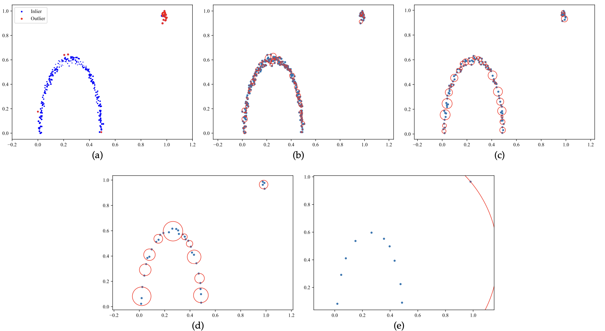

<h1 align="center"><strong>Fuzzy Granule Density-Based Outlier Detection with Multi-Scale Granular Balls</strong></h1>
<p align="center">
  <a href='#' target='_blank'>Can Gao<sup>1</sup></a>&emsp;
  <a href='https://xiaofeng-tan.github.io/' target='_blank'>Xiaofeng Tan<sup>1</sup></a>&emsp;
  <a href='#' target='_blank'>Jie Zhou<sup>1</sup></a>&emsp;
  <a href='#' target='_blank'>Weiping Ding<sup>2</sup></a>&emsp;
  <a href='#' target='_blank'>Witold Pedrycz<sup>3</sup></a>&emsp;
  <br>
  <sup>1</sup>Shenzhen University&emsp;
  <sup>2</sup>Nantong University&emsp;
  <sup>3</sup>University of Alberta&emsp;
</p>

<p align="center">
  <a href="https://ieeexplore.ieee.org/abstract/document/10821488">
    
  </a>
  <a href="https://ieeexplore.ieee.org/abstract/document/10821488">
    
  </a>
  <a href="https://github.com/Xiaofeng-Tan/MGBOD">
    
  </a>
</p>

This repository provides the official implementation of the TKDE 2025 paper "**Fuzzy Granule Density-Based Outlier Detection with Multi-Scale Granular Balls**". For any questions, please feel free to contact us via 📧 email (xiaofengtan@seu.edu.cn) or WeChat (txf_06_20)!

## 🎉 News
- **2025-11-12**: Released **visualization codes** (matching the style of figures below) in the ["vis_gb.py"](./main/vis_gb.py) folder. Thanks to Peng Dai for his valuable suggestion.
- **2025-03-15**: Released codes for **reproducing other baselines** in the ["test"](./test) folder. Thanks to [@Zhiyu Chen](https://github.com/czy629).
- **2024-12-24**: Our paper has been accepted by IEEE Transactions on Knowledge and Data Engineering.
- **2024-09-13**: Released the main experiment codes.

## 🌟 Related Works
Here are some notable outlier detection works based on Granular Balls:

- **A Kernelized Fuzzy Approximation Fusion Model with Granular-ball Computing for Outlier Detection** (Information Fusion) [[pdf](https://www.sciencedirect.com/science/article/pii/S1566253525007729)] [[code](https://github.com/LYXRhythm/KFGOD)]
- **Identifying Outliers via Local Granular-Ball Density** (TNNLS) [[pdf](https://ieeexplore.ieee.org/abstract/document/11073180)] [[code](https://github.com/Mxeron/GBDO)]
- **GBMOD: A granular-ball mean-shift outlier detector** (PR) [[pdf](https://www.sciencedirect.com/science/article/pii/S0031320324008665)] [[code](https://github.com/cstzsthl/GBMOD)]
- **Granular-ball computing-based Random Walk for anomaly detection** (PR) [[pdf](https://www.sciencedirect.com/science/article/pii/S0031320325002481)] [[code](https://github.com/optimusprimeyy/GBRAD)]

If any relevant work is missing, please feel free to open an issue or contact us via email (txf0620@gmail.com) or WeChat (txf_06_20). We greatly appreciate the contributions from the research community. 🌹

## Abstract
Outlier detection involves identifying anomalous samples that significantly deviate from the distribution of normal data, a task that has been extensively studied and applied in various practical scenarios. However, most unsupervised outlier detection methods are specifically designed to detect particular types of outliers, whereas real-world data often contains multiple outlier types simultaneously. In this study, we propose a fuzzy rough sets-based multi-scale outlier detection method capable of identifying diverse outlier types. Specifically, we first introduce a novel fuzzy rough sets approach that incorporates relative fuzzy granule density to enhance the detection of local outliers. We then propose a multi-scale view generation method based on granular-ball computing to collaboratively identify group outliers at different granularity levels. Furthermore, we utilize reliable outliers and inliers determined by three-way decision to train a weighted support vector machine, thereby improving outlier detection performance. Our method innovatively transforms unsupervised outlier detection into a semi-supervised classification problem and represents the first exploration of fuzzy rough sets-based outlier detection from a multi-scale granular balls perspective, offering high adaptability to various outlier types. Extensive experiments on both synthetic and UCI datasets demonstrate that our proposed method significantly outperforms state-of-the-art approaches, achieving at least 8.48% improvement in terms of the Area Under the ROC Curve (AUROC) metric.




## Project Structure
```
.
├── README.md
├── assets
│   ├── 1.png
│   └── 2.png
├── datasets
│   ├── 15_Hepatitis.npz
│   ├── 28_pendigits.npz
│   ├── 31_satimage-2.npz
│   ├── 35_SpamBase.npz
│   ├── 45_wine.npz
│   ├── 46_WPBC.npz
│   ├── 4_breastw.npz
│   ├── 7_Cardiotocography.npz
│   ├── MVTec-AD_carpet.npz
│   ├── MVTec-AD_metal_nut.npz
│   ├── MVTec-AD_pill.npz
│   ├── arrhythmia.mat
│   ├── autos_variant1.mat
│   ├── cardio.mat
│   ├── chess_nowin_227_variant1.mat
│   ├── ionosphere_b_24_variant1.mat
│   ├── iris_Irisvirginica_11_variant1.mat
│   ├── mammography.mat
│   ├── thyroid_disease_variant1.mat
│   └── wdbc_M_39_variant1.mat
├── main
│   ├── FRS_OD.py
│   ├── GB.py
│   ├── __pycache__
│   │   ├── FRS_OD.cpython-310.pyc
│   │   ├── GB.cpython-310.pyc
│   │   └── units.cpython-310.pyc
│   ├── main.py
│   ├── paramaters.pkl
│   └── units.py
├── paramaters.pkl
├── requirements.txt
└── results
```

## Setup
### Environment

~~conda env create -f environment.yml~~

Unfortunately, the environment configuration was not exported before the system update. However, our approach is not highly sensitive to specific environments. If you encounter any issues while running the code, please don't hesitate to contact us—we'll be happy to assist! 😊

### Datasets
The datasets are sourced from [BElloney](https://github.com/BElloney/Outlier-detection) and [ADBench](https://github.com/Minqi824/ADBench), and are provided in the `./datasets` directory.

| Dataset | Description |
|---------|-------------|
| Arrhythmia | Samples from minority classes 3, 4, 5, 7, 8, 9, 14, and 15 are grouped as outliers, while remaining samples are considered inliers. |
| Autos | Samples from "-2" and "-1" classes are treated as outliers, with other classes considered as inliers. |
| Breast | Samples in the "malignant" class are outliers, while "benign" class samples are inliers. |
| Cardio | The "pathologic" class is downsampled to 176 samples as outliers. "Normal" class samples are inliers, and "suspect" class samples are removed. |
| Cardiotocography | Classes "2" and "3" are downsampled to 33 samples as outliers, with other classes as inliers. |
| Carpet | A category from MVTec AD datasets containing both normal and defective carpet samples. |
| Chess | The "nowin" class is downsampled to 227 samples as outliers, with remaining class samples as inliers. |
| Hepatitis | "Hepatitis" class samples are outliers, while "non-hepatitis" class samples are inliers. |
| Ionosphere | Class "b" is downsampled to 24 anomalous samples, with remaining class samples as inliers. |
| Iris | "Iris-virginica" class is downsampled to 11 anomalous samples, with other classes as inliers. |
| Mammography | "Calcification" class samples are outliers, while other samples are inliers. |
| Metal Nut | A category from MVTec AD datasets containing both normal and defective metal samples. |
| Pendigits | "0" class samples are outliers, with remaining digit samples (1-9) as inliers. |
| Pill | A category from MVTec AD datasets containing both normal and defective pill samples. |
| Satimage | "2" class is downsampled to 71 anomalous samples, with other classes combined as inliers. |
| Spam | "Spam" class samples are outliers, while "non-spam" class samples are inliers. |
| Thyroid | "Hyperfunction" class samples are outliers, with normal and subnormal function samples as inliers. |
| WDBC | "M" class is downsampled to 39 samples as outliers, with other samples as inliers. |
| Wine | "1" class is downsampled to 10 samples as outliers, with "2" and "3" class samples as inliers. |
| WPBC | "R" (minority) class samples are outliers, with other samples as inliers. |

## Running
To reproduce the results reported in our paper, run the following commands:

```bash
cd main
python main.py
```

The results will be saved in the `./results` directory.

## Visualization

```bash
cd main
python vis_gb.py
```

## Modules
This project includes the following key modules:

1. `./main/FRS_OD.py`: Implementation of FRS-based outlier detection methods and their variants in GB views
2. `./main/GB.py`: Implementation of GB generation methods and view updates
3. `./main/units.py`: Auxiliary utility functions
4. `./paramaters.pkl`: Hyperparameter settings

## Appendix
Please refer to the following files for additional details:
- ["The detailed description of datasets.pdf"](https://github.com/Xiaofeng-Tan/MGBOD/blob/main/The%20detailed%20description%20of%20datasets.pdf)
- ["Relationship Analysis.pdf"](https://github.com/Xiaofeng-Tan/MGBOD/blob/main/Appendix_A_Relationship_Analysis.pdf)

## Acknowledgement
This work builds upon several excellent research works and open-source projects. We sincerely thank all the authors for their contributions:

- https://github.com/Minqi824/ADBench

## Citation
If you find this repository helpful in your research, please consider citing our paper and starring the repository ⭐.

```bibtex
@ARTICLE{10821488,
  author={Gao, Can and Tan, Xiaofeng and Zhou, Jie and Ding, Weiping and Pedrycz, Witold},
  journal={IEEE Transactions on Knowledge and Data Engineering}, 
  title={Fuzzy Granule Density-Based Outlier Detection with Multi-Scale Granular Balls}, 
  year={2025},
  volume={},
  number={},
  pages={1-16},
  keywords={Outlier detection;fuzzy rough sets;fuzzy granule density;multi-scale granular balls;three-way decision},
  doi={10.1109/TKDE.2024.3525003}}
```
