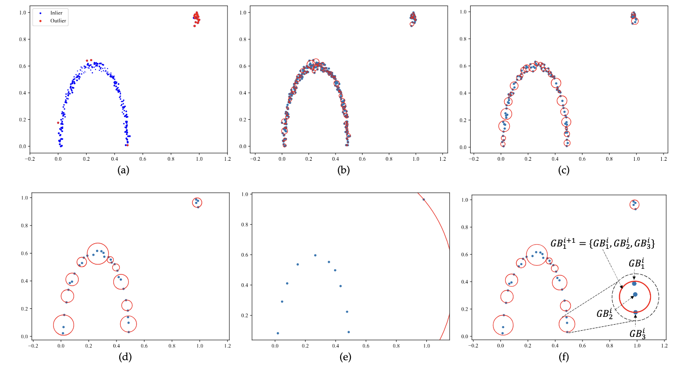

# Fuzzy Granule Density-Based Outlier Detection with Multi-Scale Granular Balls
Can Gao, [Xiaofeng Tan](https://xiaofeng-tan.github.io/), Jie Zhou, Weiping Ding, and Witold Pedrycz

This repository is the official implementation of the TKDE submission "**Fuzzy Granule Density-Based Outlier Detection with Multi-Scale Granular Balls**".

<!-- Visit our [**webpage**](https://www.pinlab.org/coskad) for more details. -->
## Abstract
Outlier detection refers to the identification of anomalous samples that deviate significantly from the distribution of normal data and has been extensively studied and used in a variety of practical tasks. However, most unsupervised outlier detection methods are carefully designed to detect specified outliers, while real-world data may be entangled with different types of outliers. In this study, we propose a fuzzy rough sets-based multi-scale outlier detection method to identify various types of outliers. Specifically, a novel fuzzy rough sets-based method that integrates relative fuzzy granule density is first introduced to improve the capability of detecting local outliers. Then, a multi-scale view generation method based on granular-ball computing is proposed to collaboratively identify group outliers at different levels of granularity. Moreover, reliable outliers and inliers determined by the three-way decision are used to train a weighted support vector machine to further improve the performance of outlier detection. The proposed method innovatively transforms unsupervised outlier detection into a semi-supervised classification problem and for the first time explores the fuzzy rough sets-based outlier detection from the perspective of multi-scale granular balls, allowing for high adaptability to different types of outliers. Extensive experiments carried out on both artificial and UCI datasets demonstrate that the proposed outlier detection method significantly outperforms the state-of-the-art methods, improving the results by at least 8.48% in terms of the Area Under the ROC Curve (AUROC) index.


 

## Content
```
.
├── README.md
├── assets
│   ├── 1.png
│   └── 2.png
├── datasets
│   ├── 15_Hepatitis.npz
│   ├── 28_pendigits.npz
│   ├── 31_satimage-2.npz
│   ├── 35_SpamBase.npz
│   ├── 45_wine.npz
│   ├── 46_WPBC.npz
│   ├── 4_breastw.npz
│   ├── 7_Cardiotocography.npz
│   ├── MVTec-AD_carpet.npz
│   ├── MVTec-AD_metal_nut.npz
│   ├── MVTec-AD_pill.npz
│   ├── arrhythmia.mat
│   ├── autos_variant1.mat
│   ├── cardio.mat
│   ├── chess_nowin_227_variant1.mat
│   ├── ionosphere_b_24_variant1.mat
│   ├── iris_Irisvirginica_11_variant1.mat
│   ├── mammography.mat
│   ├── thyroid_disease_variant1.mat
│   └── wdbc_M_39_variant1.mat
├── main
│   ├── FRS_OD.py
│   ├── GB.py
│   ├── __pycache__
│   │   ├── FRS_OD.cpython-310.pyc
│   │   ├── GB.cpython-310.pyc
│   │   └── units.cpython-310.pyc
│   ├── main.py
│   ├── paramaters.pkl
│   └── units.py
├── paramaters.pkl
├── requirements.txt
└── results
```

## Setup
### Environment
```sh
conda env create -f environment.yml
```

### Datasets
The datasets are selected from [BElloney](https://github.com/BElloney/Outlier-detection) and [ADBench](https://github.com/Minqi824/ADBench), and provided in 
```
./datasets.
```

|Datasets| Description                                                                                                                                                                                                      |
|----------|------------------------------------------------------------------------------------------------------------------------------------------------------------------------------------------------------------------|
| Arrhyth  | Samples from the minority classes 3, 4, 5, 7, 8, 9, 14, and 15 are grouped into outliers, while the remaining samples are considered as inliers.                                                                 |
| Autos    | Samples from "-2" and "-1" classes are regarded as outliers, and samples from other classes are considered as inliers.                                                                                         |
| Breast   | Samples in the "malignant" class are treated as outliers, while samples in the "benign" class are considered as inliers.                                                                                       |
| Cardio   | The "pathologic" class is downsampled to 176 samples, and these samples are regarded as outliers. Samples in the "normal" class are considered as inliers, and samples in the "suspect" class are all removed. |
| Cardioto | The classes "2" and "3" are downsampled to 33 samples and selected as outliers, while other classes are all considered inliers.                                                                                |
| Carpet   | This is a category from the commonly used MVTec AD datasets and contains both normal and defective carpet samples.                                                                                               |
| Chess    | The classes "nowin" is downsampled to 227 samples and treated as outliers, while other samples from the remaining class are considered as inliers.                                                              |
| Hepat    | Samples in the "hepatitis" class are regarded as outliers, and samples in the "non-hepatitis" class are considered as inliers.                                                                                 |
| Iono     | The classes "b" is downsampled to 24 anomalous samples, where samples from the remaining class are recognized as inliers.                                                                                       |
| Iris     | The "iris-virginica" class is downsampled to 11 anomalous samples, and samples from other classes are considered as inliers.                                                                                    |
| Mammo    | Samples in the "calcification" class are regarded as outliers, and other samples are considered as inliers.                                                                                                     |
| Metal    | This is a category from the commonly used MVTec AD datasets and contains both normal and defective metal samples.                                                                                                |
| Pen      | Samples in the "0" class are regarded as outliers, and the remaining digit samples (1 to 9) are considered as inliers.                                                                                          |
| Pill     | This is a category from the commonly used MVTec AD datasets and contains both normal and defective pill samples.                                                                                                 |
| Sat      | The "2" class is downsampled to 71 anomalous samples, while samples from other classes are combined to be inliers.                                                                                              |
| Spam     | Samples in the "spam" class are regarded as outliers, and samples in the "non-spam" class are considered as inliers.                                                                                           |
| Thyroid  | Samples in the "hyperfunction" class are treated as outliers, while samples in the normal and subnormal functions are considered as inliers.                                                                    |
| WDBC     | The "M" class is downsampled 39 samples and recognized as outliers, while other samples are considered as inliers.                                                                                              |
| Wine     | The "1" class is downsampled to 10 samples and treated as outliers, while samples from the "2" and "3" classes are considered as inliers.                                                                     |
| WPBC     | Samples in the "R" (minority) class are recognized as outliers, and other samples are regarded as inliers.                                                                                                      |

### **Running** 
To reproduce the results reported in our paper, you can run the code as follows:
``` sh
cd main
python main.py
```
The result will be saved in the folder ./results.

## **Modules**
This project contains the following important modules:
1. ``./main/FRS_OD.py``: the implementation of FRS-based outlier detection methods, and the variant in GB views;
2. ``./main/GB.py``: the implementation of GB generation methods and views update;
3. ``./main/units.py``: some auxiliary function;
4. ``./paramaters.pkl``: the hyperparameter settings.


## Appendix
### The relationship between the number of granular balls and the samples

### The computed complex 


